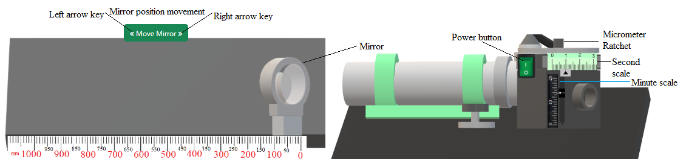

## Procedure

<!-- 

  
Figure 1. Gear tooth vernier caliper with spur gear          

 -->

1. First click on the green power button to switch on the monochromatic light source. The mirror will be at the
zero position first (0-110 mm). There will be missalignment between target graticule and setting graticule
horizontal lines in the reflected image on the mirror. 

  
Figure 1. Measurement of alignment using Autocollimator simulation model          

2. The micrometer adjustment is provided for controlling the coincidence of setting graticule and the target image photo-electrically. Click on the ratchet of the micrometer untill the horizontal lines of setting and target graticule coincides.

3. Click on 'Calculate' button to observe the measurements. Click on 'Table' at the bottom of the page and click on 'Show Table' button to tabulate the readings.

4. Switch off the power button. Now move the mirror to next position (110-220 mm) in the left by clicking on the left side arrow key of 'Move Mirror' button once. Follow steps 1-3 to note the second observation.

5. Follow step 4 again for positions 220-330, 330-440, 440-550, 550-660, 660-770 and 770-880 mm. At the end eight observations will be generated.

6. Now click on "Cumulative Error (&micro;m) Vs. Position (mm)" or "Error from horizontal straight line (&micro;m) Vs. Position (mm)" under 'Plot' to observe the plots.

7. Click on 'Clear' button.
