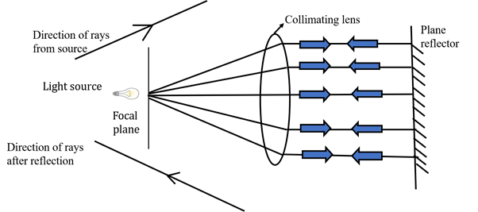
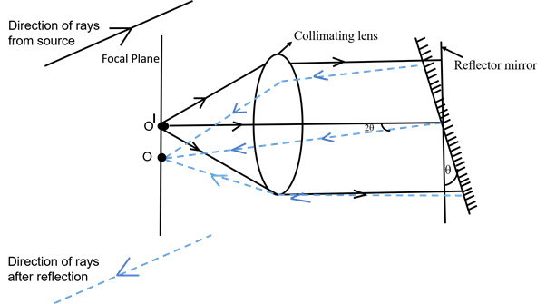
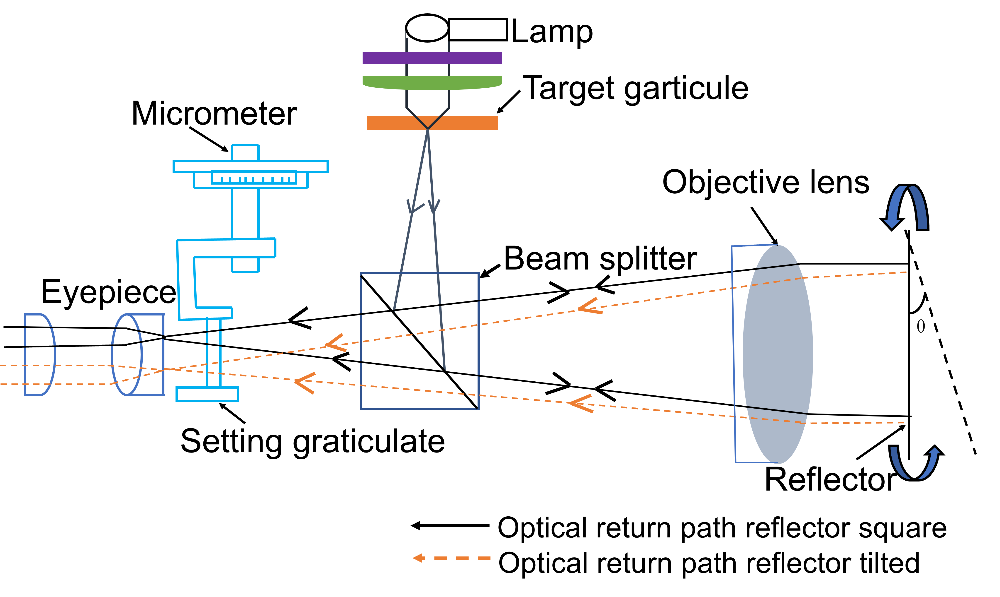

## Theory

Autocollimators are optical instruments used to measure small angular differences, and  also used to measure  straightness, flatness, and alignment. They are  highly sensitive to small  angular changes. It works as a  collimator and an infinity telescope together. These are mostly used to measure deflections in a surface.

**Basic   principle:**

Autocollimator works on the principle of reflection of light. It uses a monochromatic light source emitting a beam of light rays directed towards a beam reflector placed on the surface to be tested. Upon hitting the reflector,  the  reflected beam is converged  to a plane that can be viewed. If the surface is flat and devoid of angular deviations, the rays reflect back along their original path, converging at a plane at the focal distance from the converging lens as shown in Fig. 1. 

<b>Fig. 1. Reflector is at 90 &deg; with the direction of rays</b>

However, when the object is tilted, reflected rays create an angle with incident beam, deviating from the original path by a certain number of degrees (as shown in Fig. 2) shifting the point of focus in the focal plane.

<b>Fig. 2. Reflector is not at right angles to the direction of the rays</b>

**Working of Autocollimator**

Autocollimator mainly consists of three main parts i.e. micrometer, lighting unit objective lens and target graticule. Fig. 3. shows line diagram of auto collimator. A target graticule is a fixed reference pattern (usually a crosshair) that act as the reference point for measuring angular displacements. It is placed perpendicular to the optical axis.

When lamp illuminates the target graticule, light rays diverge out and is directed by a beam splitter to reach the objective lens. The light rays projected from the objective lens are parallel to the optical axis.

<b>Fig. 3. Line diagram of autocollimator</b>

A flat reflector is placed in front of the objective lens, perfectly normal to the optical axis, and redirected light rays come back to their original paths. These rays meet precisely at the junction of the target graticule. A portion of the returning light travels through the beam splitter and becomes visible through the eyepiece. If the reflector is tilted, the reflected beam (deviated) is directed to the target graticule which is displaced linearly from the actual position. For example, if the reflector is tilted, by an angle (&theta;), this results in linear displacement (x) of the image which is clearly visible in the eyepiece. Linear displacement ‘x’ is proportional to the angular tilt  is given by ‘x = 2 f &theta;’. This linear displacement can be measured  by adjusting the knob of micrometer, and the corresponding micrometer displacement is recorded. The measured displacement directly corresponds to the angular change of the reflector, which is used to determine the flatness of surface. Thus, autocollimator is highly useful for verifying angular deviation, and checking small linear displacements accurately.

								