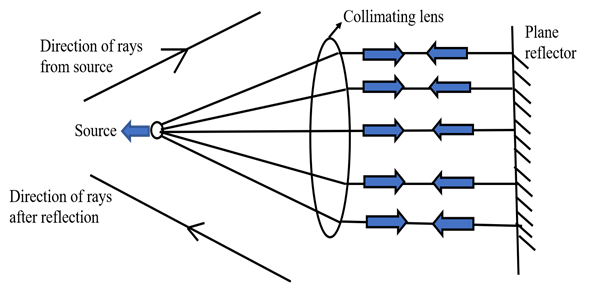
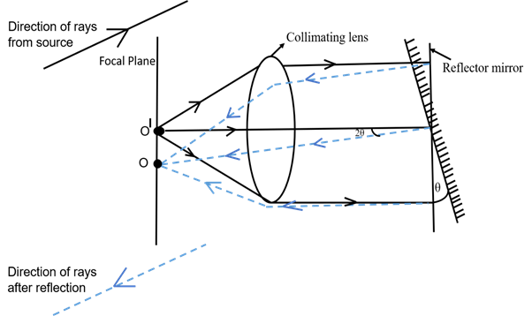
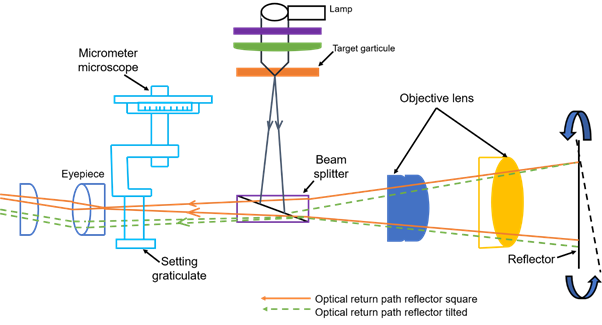

## Theory

Autocollimators are optical instruments used to measure small angular differences, and  also used to measure  straightness, flatness, and alignment. They are  highly sensitive to small  angle changes and measure angular deviations exactly. It is essentially a collimator and an infinity telescope together. These are mostly used to align the various components of a system and measure their optical or mechanical deflections.

**Basic   principle:**

Autocollimator works on the principle of reflection of light. It uses a monochromatic light source emitting a beam of light rays directed towards a beam reflector. Upon hitting the reflector, the beam is reflected at a 90º angle, converging towards the lens. The converging lens then align the rays to be parallel and direct them towards the reflecting surface. The parallel rays strike the surface or object being observed. If the surface is flat and devoid of angular deviations, the rays reflect back along their original path, converging at a received place at the focal distance from the converging lens as shown in figure 1. 

Figure 1:- Reflector is at 90 &deg; with the direction of rays

However, when the object is tilted reflected rays create an angle with incident beam, deviating from the original path by a certain number of degrees as shown in figure 2. 

Figure 2:- Reflector is not at right angles to the direction of the rays

**Working of Autocollimator**

Autocollimator mainly consists of three main parts micrometer microscope, lightning unit and collimating lens. Figure 3 shows line diagram of auto collimator. A target graticule is located perpendicular to the optical axis. When  lamp illuminates the target graticule, light rays diverging from the intersection of points pass through a beam splitter to reach the objective lens. The light rays projected from the objective are parallel to the reflector.

Figure 3:- Line diagram of auto collimator

A flat reflector is placed in front of the objective, perfectly normal to the optical axis, and redirects light rays back to their original paths. These rays meet precisely at the junction of the target graticule. A fraction of the returning light travels through the beam splitter and becomes visible through the eyepiece. If the reflector is tilted, the reflected beam deviates from its original path by twice the angle of tilt. It can be brought to the target graticule and displaces linearly from the actual target by an amount equal to 2 &theta; multiplied by the focal length ( 2 &theta; &times; f ). The linear displacement of the graticulate image in the plane tilted angle of the eyepiece directly correlates with the angle of reflector. This correlation is measurable using optical micrometer. Autocollimator proves especially useful for verifying angular indexing, and checking small linear displacements accurately.

								